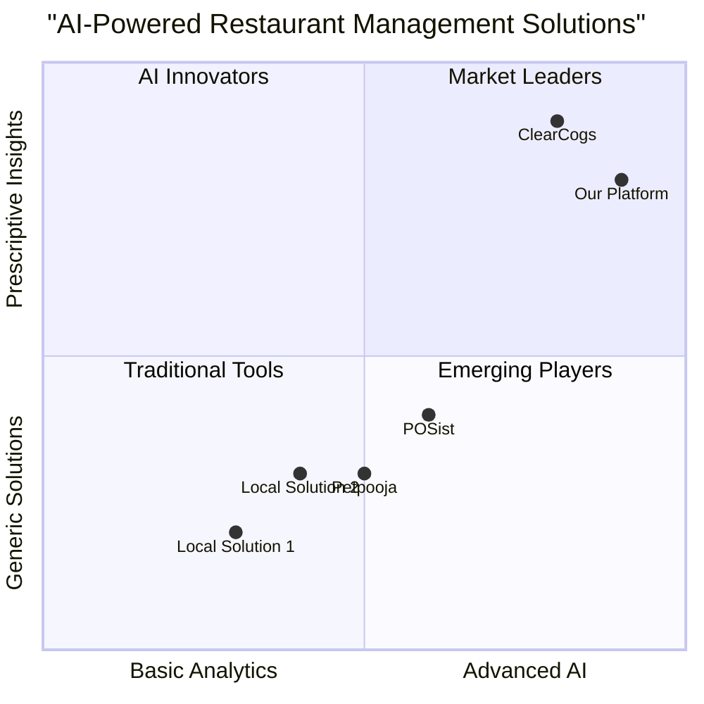

# Product Requirements Document: Prescriptive AI Restaurant Management Platform

## 1. Project Overview

### 1.1 Product Vision
Transform restaurant operations through Prescriptive AI technology that converts complex data into actionable insights, focusing on waste reduction, profitability enhancement, and operational efficiency.

### 1.2 Project Information
- Project Name: Orkeneo
- Platform: Web Application
- Technology Stack: Next.js, JavaScript, Tailwind CSS

### 1.3 Product Goals
1. Reduce food waste through AI-powered demand forecasting and inventory optimization
2. Increase profitability with data-driven menu engineering and cost control
3. Optimize operations through prescriptive insights and automated recommendations

## 2. User Stories

### 2.1 Restaurant Owner
- As a restaurant owner, I want to receive AI-powered insights about my business performance so that I can make data-driven decisions
- As a restaurant owner, I want to see predicted demand patterns so that I can optimize my inventory and staffing
- As a restaurant owner, I want to understand my menu profitability so that I can optimize pricing and offerings

### 2.2 Kitchen Manager
- As a kitchen manager, I want to receive smart reorder recommendations so that I can maintain optimal inventory levels
- As a kitchen manager, I want to track food waste in real-time so that I can implement immediate corrective actions
- As a kitchen manager, I want to see ingredient-level demand forecasts so that I can plan prep work efficiently

### 2.3 Staff
- As a staff member, I want a simple interface to log waste and inventory counts
- As a staff member, I want clear actionable tasks based on AI recommendations
- As a staff member, I want to easily understand and implement system suggestions

## 3. Competitive Analysis



## 4. MVP Feature Requirements

### 4.1 Prescriptive AI Engine (P0)

#### 4.1.1 Demand Forecasting
- Daily/weekly/monthly sales predictions
- Item-level demand forecasting
- Special event impact analysis
- Weather correlation modeling

#### 4.1.2 Inventory Intelligence
- Dynamic par level optimization
- Smart reorder recommendations
- Waste prediction alerts
- Cross-utilization suggestions

#### 4.1.3 Menu Engineering
- Profitability analysis
- Price optimization recommendations
- Popular combination analysis
- Seasonal menu suggestions

### 4.2 Data Collection & Integration (P0)

#### 4.2.1 POS Integration
- Real-time sales data sync
- Menu item mapping
- Order pattern analysis
- Integration with:
  * POSist
  * Petpooja
  * Rista POS

#### 4.2.2 External Data Sources
- Weather data API integration
- Local events calendar
- Market price feeds
- Seasonal trend data

### 4.3 Actionable Insights Dashboard (P0)

#### 4.3.1 Executive Dashboard
- Key performance metrics
- Trend analysis
- Comparative analytics
- Alert notifications

#### 4.3.2 Operational Insights
- Daily task recommendations
- Stock level warnings
- Waste reduction opportunities
- Staff scheduling suggestions

### 4.4 Staff Interface (P1)

#### 4.4.1 Task Management
- Priority-based task list
- Action item tracking
- Implementation verification
- Performance metrics

## 5. Technical Architecture

### 5.1 System Components

```javascript
// High-level Architecture
const systemArchitecture = {
  frontend: {
    framework: 'Next.js',
    ui: 'Tailwind CSS',
    stateManagement: 'Redux',
    dataVisualization: 'D3.js'
  },
  backend: {
    api: 'Node.js/Express',
    ml: 'Python/FastAPI',
    database: 'PostgreSQL',
    cache: 'Redis'
  },
  aiEngine: {
    forecasting: 'Prophet/TensorFlow',
    recommendations: 'Custom ML Models',
    optimization: 'Linear Programming'
  }
};
```

### 5.2 Data Flow

```javascript
// Data Processing Pipeline
const dataFlow = {
  collection: {
    pos: 'Real-time sync',
    inventory: '5-minute intervals',
    external: 'Daily updates'
  },
  processing: {
    cleaning: 'Automated validation',
    transformation: 'Stream processing',
    enrichment: 'External data fusion'
  },
  analysis: {
    forecasting: 'Hourly updates',
    recommendations: 'Real-time',
    alerts: 'Event-driven'
  }
};
```

## 6. Implementation Phases

### 6.1 Phase 1: Foundation (Weeks 1-4)
- POS integration setup
- Basic data collection pipeline
- Simple forecasting models
- Core dashboard implementation

### 6.2 Phase 2: Intelligence (Weeks 5-8)
- Advanced AI models deployment
- Inventory optimization engine
- Menu engineering features
- Enhanced analytics dashboard

### 6.3 Phase 3: Optimization (Weeks 9-12)
- Prescriptive recommendation engine
- Staff interface and task management
- Advanced reporting and analytics
- System optimization and scaling

## 7. Success Metrics

### 7.1 Business Metrics
- Food waste reduction: Target 25%
- Profit margin improvement: Target 15%
- Labor cost optimization: Target 10%
- Inventory carrying cost reduction: Target 20%

### 7.2 Technical Metrics
- Forecast accuracy: >90%
- System uptime: >99.9%
- API response time: <500ms
- Data sync delay: <2 minutes

## 8. Open Questions

### 8.1 Technical Considerations
- Machine learning model update frequency
- Data storage requirements for historical analysis
- Scaling strategy for multiple locations
- Offline operation capabilities

### 8.2 Business Considerations
- Pricing strategy for different restaurant sizes
- Training and onboarding process
- Customer support structure
- Feature prioritization for different segments

## 9. Future Roadmap

### 9.1 Phase 4: Enhancement
- Mobile application development
- Advanced AI model refinement
- Additional POS integrations
- Enhanced reporting capabilities

### 9.2 Phase 5: Expansion
- Multi-location optimization
- Supply chain integration
- Vendor management system
- Custom API for enterprise clients